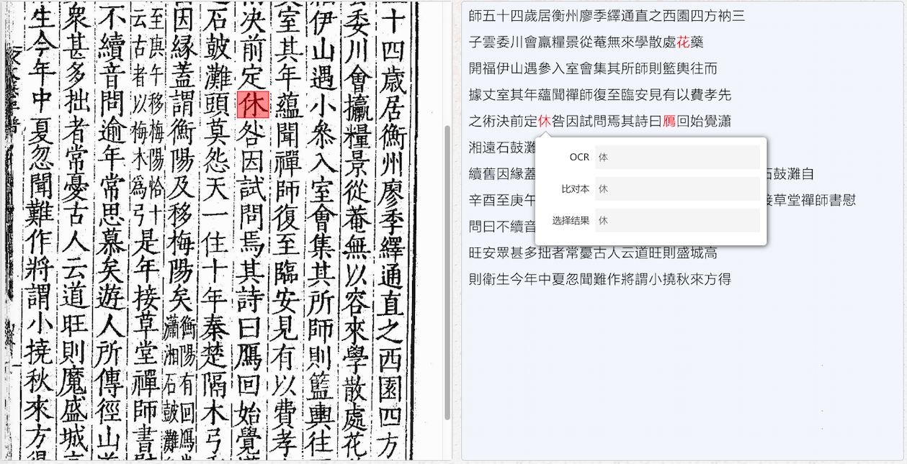
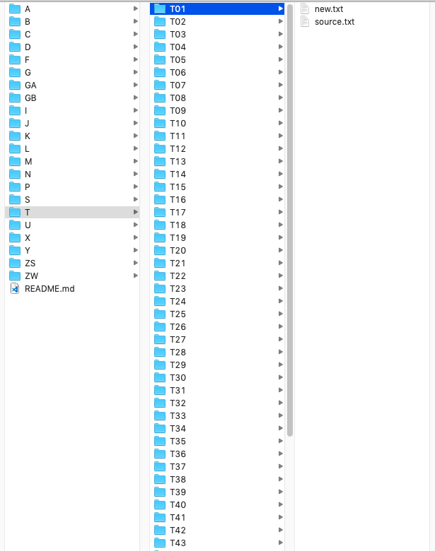
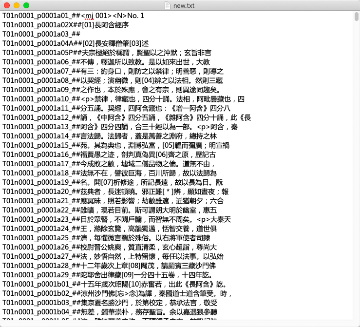

# CBETA Search
## 一、背景

大藏经数字化平台中，为了加速文字校对的速度，避免人工逐字校对，我们考虑利用ES的全文检索技术，从CBETA文本数据中检索与OCR文本相似的文本，作为比对本。

如上图中，针对左侧图片，我们将OCR文本和比对本（从CBETA中找出）进行比对，差异之处用红色高亮显示出来，用户只需要针对这些差异处校对即可。

## 二、CBETA数据介绍

CBETA简单标记版的数据放在Github上，链接为：https://github.com/mahawu/BM_u8。整个文本库大约1.69G，目录结构如下：

第一层是藏经，第二层是册，new.txt表示该册对应的文本。格式如下：

T01n0001_p0001a03：T表示大正藏，n表示第几部经，p表示第几页，a表示第几栏（a/b/c表示上/中/下三栏），合计起来表示大正藏第一册第一部经第一页第一栏第三行。

## 三、需求

针对一页图像的OCR文本，从CBETA中找出与之相似的文本。
值得考虑的是，在使用ES建索引的时候，如果OCR的文本正好分布在前后两个document中，应如何从前后两个document中拼出一份完整的比对本。
